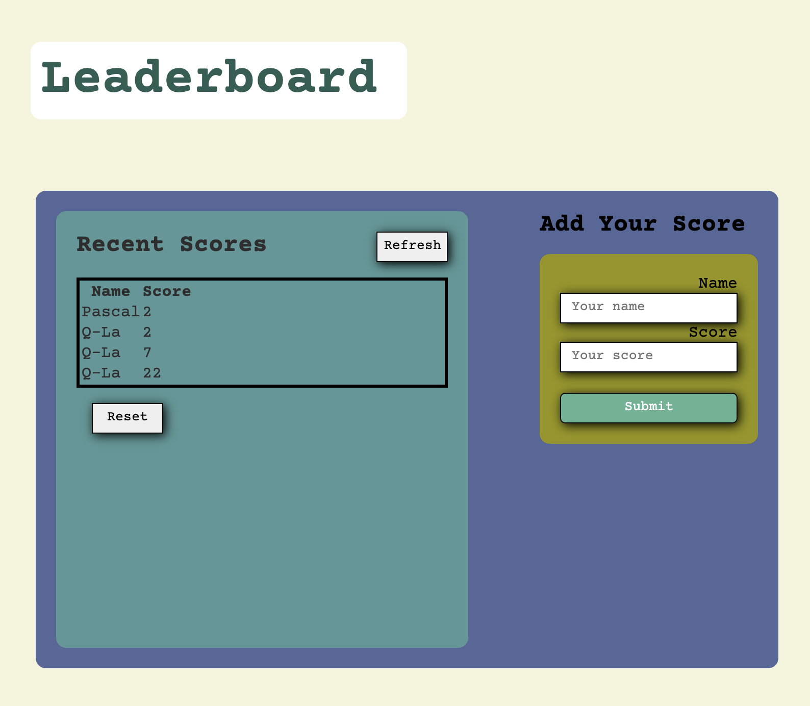

# Leaderboard-ps

> The leaderboard website displays scores submitted by different players. It also allows you to submit your score. All data is preserved thanks to the external Leaderboard API service.

> Have a look on its simple Design

> 

## Built With

- HTML, CSS
- WEBPACK

## Live Demo

Not yet available!

## Getting Started

To get a local copy up and running follow these simple example steps.

### Prerequisites

By running this project loccally, you will be required yo have:

- A computer having diffents browsers
- VSCode, node installed
- Few knowledge about Node package module(npm) to start the app.
- Run `npm start` after installing dependencies in order to run the app

### Setup, Install, and Usage

Follow these steps to install

- You will need to install webpack
- linters

## Authors

👤 **PASCAL KABIKA MP.**

- GitHub: [KABIKA681](https://github.com/KABIKA681?tab=overview&from=2021-12-01&to=2021-12-31)
- LinkedIn: (https://www.linkedin.com/in/pascal-kabika-443061220/)

## 🤝 Contributing

Contributions, issues, and feature requests are welcome!

Feel free to check the [issues page](git@github.com:KABIKA681/Leaderboard-ps.git).

## Show your support

Give a ⭐️ if you like this project!

## Acknowledgments

- Hat tip to the Microverse team for the guidance and reviews.

## 📝 License

This project is [MIT](./MIT.md) licensed.
